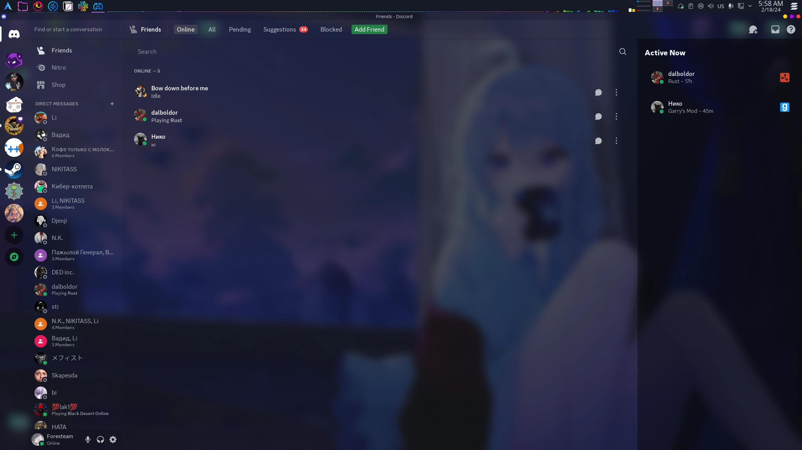

## NBetterDefaultGlasscord (v3.0.0)
A Discord theme with easy config and sleek user UI and design. With support for multiple clients & glasscord.

### WORK IN PROGRESS



## How To Install BetterDefaultGlasscord

Its Simple!

For **Powercord** Users:

1. Open CMD & Type:

```
cd powercord/src/Powercord/themes && git clone https://github.com/Foresteam/NBetterDefaultGlasscord
```

For **BetterDiscord** Users:

1. Open `https://raw.githubusercontent.com/Foresteam/NBetterDefaultGlasscord/main/support/betterdiscord/NBetterDefaultGlasscord.theme.css` & Click Download Raw

# Extras 

Thank you for checking out/downloading my Theme :)

# Check out the original theme
* **[BetterDefaultGlasscord](https://github.com/leeprky/BetterDefaultGlasscord)**
